# Zibersegurtasuna 2022-23
**2022-23 ikasturteko memoria**

## Aurkibidea

1. [Aurkezpena:](#1aurkezpena)
2. [2023ko zifrak:](#22023ko-zifrak)
3. [Lan ildoak:](#3lan-ildoak)
   - 3.1 [Proiektuak:](#31-proiektuak)
   - 3.2 [Pilotuak:](#32-pilotuak)
      - 3.2.1 [DarkTrace:](#321-darktrace)
      - 3.2.2 [Smartfense:](#322-smartfense)
      - 3.2.3 [Pentesting:](#323-pentesting)
   - 3.3 [Ikastaroak:](#33-ikastaroak)
   - 3.4 [Sortutako edukiak:](#34-sortutako-edukiak)
4. [Harremanak eta Komunikazioa:](#4harremanak-eta-komunikazioa)
---------------------------------------------------------------------------------------------------------------------------------------------
## 1.Aurkezpena:
2022-23 ikasturtean zehar **Tknikako Zibersegurtasun** lantaldean jorratu diren edukiak agertzen dira jarraian. Edukiak zerrendatzeaz gain, erabilitako fitxategi edo sorturiko materialetara iristeko estekak ere badaude. 

## 2.2023ko zifrak:
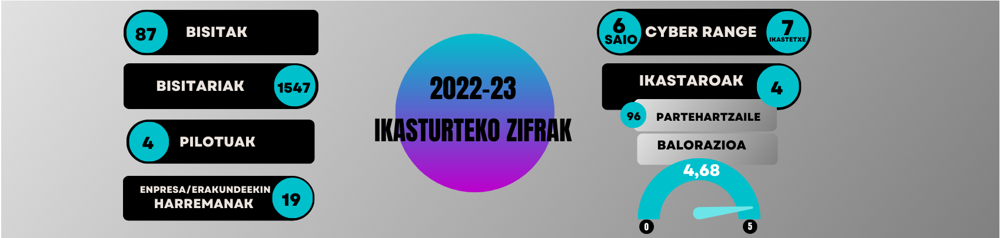  

## 3.Lan ildoak:
  - ### 3.1 Proiektuak:
     - **Cyber Range:**
     Cyber Range azpiegiturak zibersegurtasuneko ezagutzak modu praktiko batean neurtzeko eta trebatzeko balio du. Bertan, partehartzaileak taldekatzen dira eta denbora mugatu batean gailendu beharreko erronka ezberdinak proposatzen zaizkie. Aurtengo ikasturtean landu diren erronkak IT zibersegurtasuna eta OT zibersegurtasuna uztartzen dituzte.

       

     Ondorengo irudian Cyber Rangearen egitura azaltzen da, eta atal bakoitzean erabilitako tresna edo teknologia:

       

      Egitura osatzen duten elementuak honakoak dira:
      1. Kudeaketa zerbitzaria: Saioak, erronkak, partehartzaileak etab. kudeadetzeaz arduratzen den zerbitzaria da. Gertakariak publikatzeaz ere arduratzen da.
      2. MQTT brokerra: Mosquitto teknologia erabiltzen da eta kudeaketako zerbitzariak sortutako gertakariak biltzen ditu.
      3. Bistaratze aplikazioa: MQTT brokerrean plazaratu diren gertakariak erabiliz, Cyber Range saioan gertatzen ari dena modu erakargarri batean erakustea da bere helburua.
      4. Erronka ingurunea: Proxmox birtualizazio teknologia irekian oinarritzen da, eta erronkak gauzatzeko ingurunea (enpresa baten antza duena) definitzen da bertan.

       
         - Cyber Range Saioak: Aurtengo ikasturtean zehar 6 Cyber Range saio izan ditugu Tknikan, 7 ikastetxe ezberdinetako ikasleak bildu dituztenak. Partehartzaileengandik jasotako feedback-a oso positiboa izan da orokorrean.
       
            |        Zentrua        |    Data    |
            | :-------------------- | :--------- |
            | Maristak              | 2022/09/22 |
            | Andra Mari /Laudioalde| 2023/02/02 |
            | Easo                  | 2023/02/09 |
            | Txurdinaga            | 2023/02/28 |
            | Zubiri Manteo         | 2023/03/07 |
            | SEIM                  | 2023/05/03 |

         - Ikastetxeetara transferentzia: Cyber Rangerako sortu den guztia (egitura azaldu denean aipatutakoak) zentruetara iristeko nahia eta helburua daukagu. Aurten, eta froga gisa, [Andra Mari LH](https://fpandramari.eus/eu/hasiera/) zentrura egin da transferentzia. **Zuk ere interesa baduzu zure zentruan mota honetako azpiegitura bat martxan jartzeko, jarri gure alorrarekin kontaktuan**.

            
         &nbsp;
         &nbsp;   
     - **OT Azpiegitura aurreratua:** 

      OT panel aurreratu bat montatu da Tknikako laborategian. Sare segmentatu batetan, gailu ezberdinak kokatu direlarik frogak egiten joateko.[Dokumentazio gida](docs/OT/Manual_panel_OT.pdf)

      <a href="docs/OT/Manual_panel_OT.pdf" class="image fit">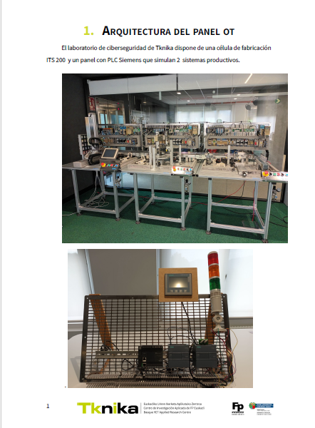</a>
      
      &nbsp;
      &nbsp;

     - **Zentruetako Proiektuak:** 
       - *Cyber Car:*
         Konektatutako ibilgailuetan, zibersegurtasunari buruzko normalizazioko organo estandarrak ezarri nahi izan dira ikastetxe ezberdinek partehartu duten proiektu honetan. Garraio-sistema adimenduetan, komunikazio-teknologiak tartean dauden konektibitatea aztertuz.  [Aurkezpena](docs/cybercar/cybercar.pdf)

         <a href="docs/cybercar/cybercar.pdf" class="image fit">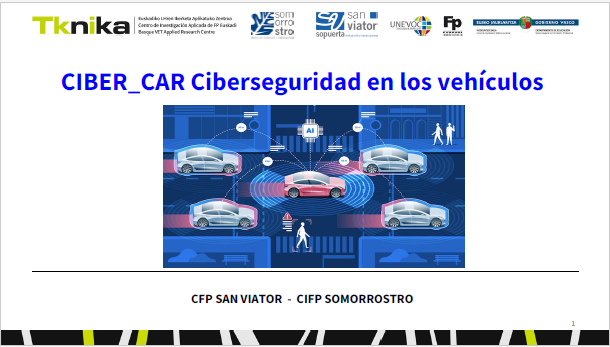</a>
          
       - *OT Erronkak:*
         Ikastetxeetarako OT erronka berriak diseinatu dira. Cyber Range saioak egiteko laborategiak prestatzearekin batera Galdakaoko Andra Mari, Barakaldo eta Txorierriko ikastetxeekin batera. Prozesu honen garapena azaltzen duen aurkezpena:
         [Aurkezpena](docs/OT/OT_Cyberrange_Aurkezpena.pdf)

         <a href="docs/OT/OT_Cyberrange_Aurkezpena.pdf" class="image fit">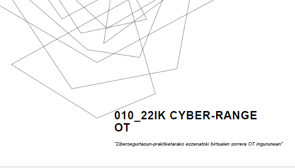</a>
  
  
  - ### 3.2 Pilotuak:
    - #### 3.2.1 **Darktrace:** 
      
    
       Aurtengo ikasturtean **Uni Eibar-Ermua** Ikastetxearekin batera, **Darktrace** izeneko tresna testeatu da saretik etor daitezken mehatxuen aurrean admien artifiziala erabiliz, eskaintzen duen babes mailaren ikerketa bat egiteko asmoarekin. Bertatik ateratako ondorioak eta pilotu honen balorazio jarraian estekatutako dokumentuan aurkitzen da.[Dokumentazio gida](docs/darktrace/DarktracePilotua.pdf)

       <a href="docs/darktrace/DarktracePilotua.pdf" class="image fit">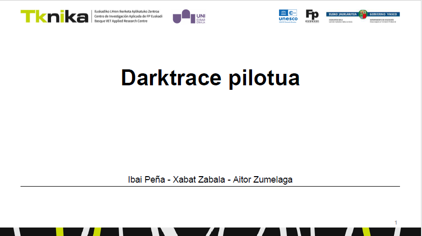</a>

    - #### 3.2.2 **Smartfense:** 
      

      Sareko zerbitzuak gero eta gehiago erabiltzen diren garai hauetan, lanerako malgutasuna irabaztearekin batera arriskuak ere areagotu dira hein haundi batetan. Arrazoi honengatik, beharrezkoa da erabiltzaileak sareko arriskuen inguruan kontzientziatzea.
      Lagin modura, **TKNIKA**ko langileen plantilla erabili da, bertako 59 langile gehitu direlarik erabiltzaile gisa. Honetarako erabili den tresna **SMARTFENSE** izan da eta bi kanpaina burutu dira Otsaila eta Ekaina artean. [Dokumentazio gida](docs/smartfense/SMARTFENSE_-_Catálogo_de_Contenidos.pdf) eta [Osagaiak-Ezaugarriak](docs/smartfense/SMARTFENSE_-_Descripción_de_Componentes_y_Características.pdf)
      - **1.kanpaina:** *Pasahitz seguruak* [Dokumentazio gida](docs/smartfense/SMARTFENSE_1KANPAINA_EMAITZAK.pdf)
        Pasahitzen seguruen kanpainari lotuta, beste ildo batzuk ere jorratu dira. Hona hemen, IMHko Pedro Arreitunandiak sorturiko edukiak.
        - Pasahitz seguruak nola sortu: https://bideoa.imh.eus/w/oTuuiEc5PSexRJWfq6RkbL
        - Pasahitz Kudeatzaileak: https://bideoa.imh.eus/w/2EG6L7CpcRaJG1TeUmQALC
        - Pasahitz Kudeatzaileak 2: https://bideoa.imh.eus/w/aZsMRqqHZmKEys5oJ9HKFQ
      - **2.kanpaina:** *Phishing-Ransomware iruzurrak* [Dokumentazio gida](docs/smartfense/SF_PHISHING_DOKUMENTUA.pdf)

      Pilotu hau Transferentzia Egunean aurkeztu zen. Hona hemen, bertan erabilitako aurkezpenaren euskarria.  [Aurkezpena](docs/smartfense/TransferentziaegunaSmartfense.pdf)

      <a href="docs/smartfense/TransferentziaegunaSmartfense.pdf" class="image fit">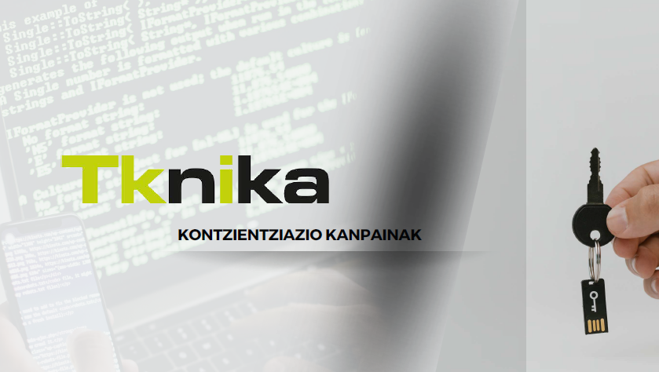</a>

    - #### 3.2.3 **Pentesting:**
      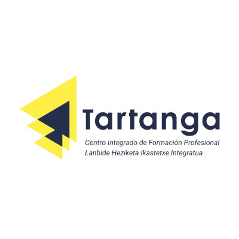 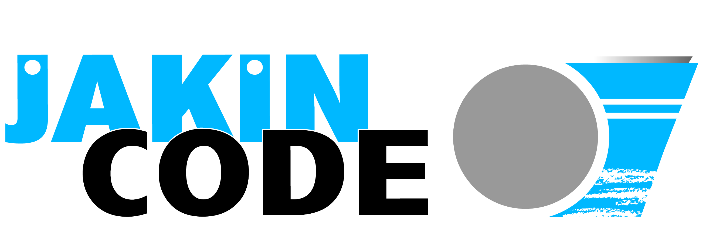
    
      **Tartanga** ikastetxearekin elkarlanean, pilotu bat martxan jarri da aurtengo ikasturtean ikastetxearen **PenTesting** froga bat egiteko. Honetan, **Txurdinaga** ikastetxeko Zibersegurtasun espezialitateko ikasle bat aritu da. [Dokumentazio gida](docs/pentesting_tartanga/PilotoPentesting.pdf)

      <a href="docs/pentesting_tartanga/PilotoPentesting.pdf" class="image fit">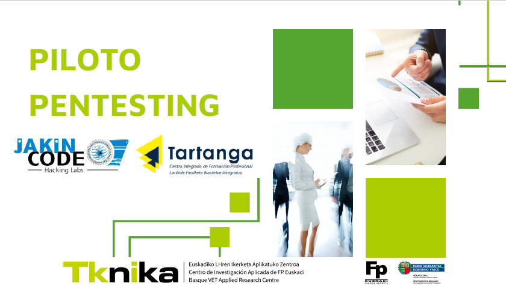</a>

  - ### 3.3 Ikastaroak:
    - **OT Zibersegurtasunaren Oinarriak:**

      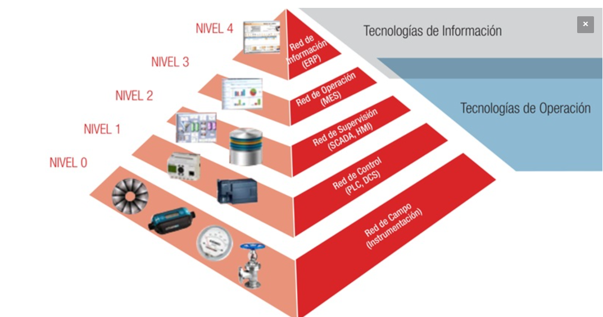

      **Martxoak 14 eta 23** bitartean, 40 irakaslek parte hartu zuten *"OT Zibersegurtasunaren Oinarriak"* ikastaroan. 20 ordutako iraupena izan zuen ikastaro honetan, **OT munduko zibersegurtasunera** hurbilketa burutu nahi izan zen.
      Horretarako aurkezpen teorikoak eta kasu praktikoak tartekatuko ziren. Kurtso amaieran aurkezpenak, kasu praktikoen gida eta alor hauetan sakontzeko material gehigarria banatuko zen. [Material guztia hemen](https://github.com/getxeberriaur/Zibersegurtasuna2022-23/tree/main/OT(SCI)Oinarriak) *Azalpenak Euskaraz, Euskarriak Gaztelaniaz.*

    - **Nozomi Guardian softwarearen proba eta trebakuntza:** 
   
      
      OT eta OiT inguruneetan, kokalekuaren araberako sarearen ikuskatze eta aktiboen inbentario sakona egiten duen tresna da nozomi guardian. Mota bereko garapen ezberdinen artean hoberenen artean dago, eta horregatik tresna probatu nahi zen.
      Horretarako Nozomi enpresarekin harremanetan jarri eta barne formakuntza bat jaso zen Tknikan. Lanketaren ondorioz Nozomi etxearekin harremana estutu zen eta beraien produktuak formakuntzarako lortzeko aukera bermatu da.
      
      

      

    - **OT Bideoformakuntza:**
      Edorta Echaveren “_Curso Online de Ciberseguridad Industrial v2.0_” bideoformakuntzara sarrera eman genien zibersegurtasun espezializazioko 8 irakasleri.

      https://enredandoconredes.classonlive.com/curso-completo/Curso-Avanzado-de-Ciberseguridad-Industrial-v20-001

      Bideoformakuntzan oinarrituz, gure kolaboratzaile Paulino Insaustik ondorengo unitate didaktikoa prestatu zuen. “[Seguridad nativa PLC](docs/OT/Bideoformakuntza/Seguridad_nativaPLC)”. 

      Ondoren bideoformakuntza jaso zuten bi irakasleen iritzia:
   
      "_Kurtsoa oso erlazionatua dago ematen ditugun edukiekin eta bereziki '5028 Sistemas de control industrial seguros' moduloarekin. Ondo estrukturatua dago, edukia ere ondo garatua dago, bideoak ondo eraikitakoak eta teknikoki landuak daude. Orokorrean oso interesgarria eta erabilgarria_"

      "_Asko ikasi dugu bai teoria, test eta jasotako praktikekin. Guk klaseak emateko daukagun laborategia hobeto ulertzeko balio izan digu eta horren ondorioz eduki gehiago eta interesgarriagoak gehitu ditugu klasean ematen ditugun azalpenetan. Formazioan egindako testak eta praktikak klasean inplementatzea da gure helburu nagusia aurten_"

      

    - **Python Hacking-erako:** 
    
       Kontuan hartuta Python-ek zibersegurtasunaren Munduan daukan arrakasta, online ikastaro hau martxan jarri da. Oso ikastaro praktikoa izan da: parte hartzaileek norbanarentzako laborategi birtual baten kontrako hacking etiko teknikak martxan jarri dituzte. 
   4 aste iraun du ikastaroak, eta horietako bakoitzean pentesting prozesu baten fase nagusiak jorratu dira: **Ezagutza (Footprinting), Zenbaketa (Fingerprintig), Ustiapena (Explotation) eta Ustiapen-ostekoa (Post-Explotation)**.  Fase horietako bakoitzean script batzuk moldatu eta exekutatu behar izan dituzte, gertatutakoa aztertuz eta enuntziatuek eskatutako soluzioak aplikazio batean sartuz [Ikastaroko Material guztia hemen](https://github.com/getxeberriaur/Zibersegurtasuna2022-23/tree/main/python%20hacking) 

    - **Sare Sozialak, mugikorrak, bullying-a, etab. irakaslearen ikuspegitik:**
      Zibersegurtasunaren gaiarekin zeharkako lotura duen arren, interesgarria iruditu zaigu formakuntza hau antolatzea. Askotan garrantzitsua bait da zer egin daitekeen, zer ez, eta kasu bakoitzean nola jokatu behar dugun, kontu hauetan irakasle gisa.

      Horretarako gaian aditu bat ekarri dugu, [Pablo Duchement](https://pduchement.org/), eta guztira hamar ordu inguru iraun duten hiru saiotan gai guzti hauek landu dira. Hemen dituzue hiru saioak:

      **Lehen saioa**
      
      https://youtube.com/live/1CRUFdjLubo?feature=share

      **Bigarren saioa**
      
      https://youtube.com/live/Exh9bPez3qE?feature=share

      **Hirugarren saioa**

      https://youtube.com/live/wl-cExXQ5JQ?feature=share

  
  - ### 3.4 Sortutako edukiak:
    - **SMB Relay erasoa:**
      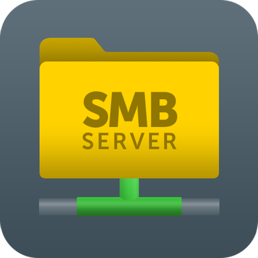
      
Eraso mota hau, Windows azpiegituretan gehienetako bat errepikatzen den eraso mota da. Active Directory instalatuta dagoen inguruneetan, SMB protokoloa erabiliz burutzen den penetrazio bat da. Ikerketa honetan jarraitutako urratsen dokumentazioa. [Dokumentazio gida](docs/smbrelay/SMBRELAY_DOKUMENTUA.pdf)

  <a href="docs/smbrelay/SMBRELAY_DOKUMENTUA.pdf" class="image fit">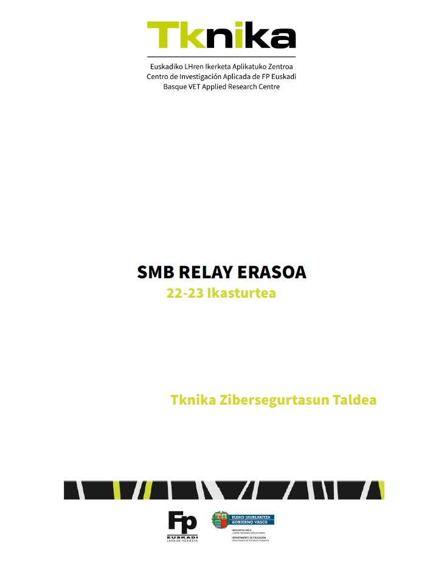</a>

## 4.Harremanak eta Komunikazioa:
   - **ZELT Lantaldea:**
     2021/2022 kurtsoan Tknikaren ekimenez sortutako taldea da Zibersegurtasun Espezializazioko Lan Taldea (ZELT). Espezializazio hau lantzen duten zentru eta irakasleen ezagutza, saretzea eta trebakuntza du helburu, eta ekintza espezifikoak lantzen dira kurtsoan zehar.

     Kurtso honetan egindako ekintza espezifikoak honakoak izan ziren:
     + Zentru bakoitzak espezializazioa nola irakasten duen partekatu.
     + Espezializazioko gai bakoitza ematen duten irakasleen zerrenda sortu, harremanak errazteko asmoz.
     + Aipatutako OT Bideoformakuntza jasotzeko aukera luzatu.
     + Cyber Range saioetan partehartzeko aukera luzatu.
     + Formakuntza behar espezifikoak aztertu.
     + Hacking etikoa eta Auzitegi Analisia irakasteko moduen azterketa, gabeziak aztertu eta hurrengo kurtsoetan kanpo laguntza bitartez ikasgai hauen edukien kalitatea hobetzeko asmoz.

   - **Teknopolis saioa:**  

   Maiatza bukaeran, EITBko Teknopolis saioaren grabaketa burutu zen. Tknikan bertan grabaturiko atalari, Andra Mari ikastetxean OT espezialitateko atalak gehitu zitzaizkion. Saioa Ekainak 15ean emititu zen.
    
   <a href="https://www.eitb.eus/eu/nahieran/teknopolis/teknopolis-eu-2022-2023/osoa/8358/209774/"> 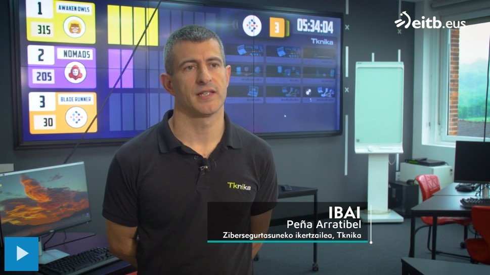 </a>
   
   - **Diario Vasco erreportaia:**
     Otsailean **Diario Vasco** egunkarian publikatutako erreportaiaren esteka. [Erreportaia](komunikazioa/dv/dv_26.02.23.pdf)
     
   - **Advanced Factories 2023 Mahai-Ingurua:**
     Ibai Peña 2023ko Apirilaren 19an Bartzelonan egin zen [Advanced Factories](https://www.advancedfactories.com/) kongresura gonbidatu zuten BCSC eta Mosos de Escuadrako ordezkariekin batera “publiko - pribatu elkarlana zibersegurtasunean” gaia landu zuen mahai inguru batera. Bertan Tknika zer den, nola lan egiten den, eta publiko - pribatu erlazioa nola ulertu eta gauzatzen den azaldu zuen.
     

     Honi buruzko aipamenak prentsan:

        [https://www.conectaindustria.es](https://www.conectaindustria.es/articulo/innovacion/inversion-ciberseguridad-sector-industrial-aumentara-34-2023/20230301131229009776.html)

        [https://worldnationnews.com](https://worldnationnews.com/investment-in-cybersecurity-in-the-industry-will-increase-by-34-by-2023/)

   - **Caso de éxito ClearPass Don Bosco:**
     Don Bosco ikastetxeak, Sarenetekin batera inplantatu duen **Clear Pass** esperientzian parte hartu du Tknikak ere. Jarraian dagoen **bideoan** informazio gehiago.
   
   
     
   - **Euskal Hack:**
          EuskalHackek 2023 edizioan parte hartu ondoren, han emaniko tailler interesgarri batzuen zenbait esteka:
     - **Offensive Logon Sessions:**  [2023/EuskalHack/EuskalHack_Offensive_Logon_Sessions.pdf](https://github.com/MrSquid25/PPTs-CONs/blob/main/2023/EuskalHack/EuskalHack_Offensive_Logon_Sessions.pdf)
    
        <a href="https://github.com/MrSquid25/PPTs-CONs/blob/main/2023/EuskalHack/EuskalHack_Offensive_Logon_Sessions.pdf" class="image fit">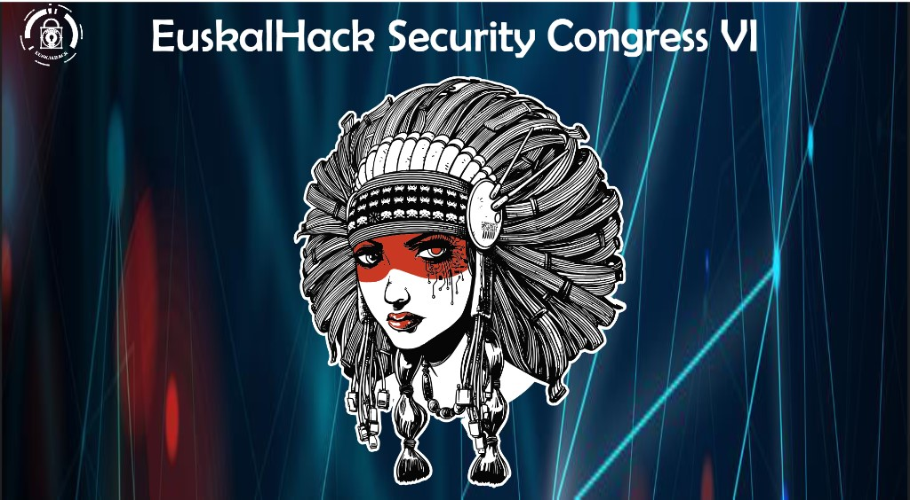</a>

     - **Reconftw:** [EuskalHack2023 Reconftw](https://github.com/six2dez/reconftw) Bertan erabilitako aurkezpenaren dokumentua. [Reconftw.pdf](docs/euskalhack/reconftw_euskalhack23.pdf)

        <a href="docs/euskalhack/reconftw_euskalhack23.pdf" class="image fit">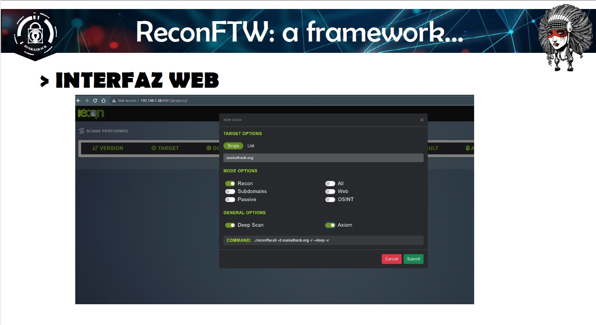</a>

   - **Transferentzia Eguna:** 

   **Ekainak 22**an burutu zen **Transferentzia Egunean**, ikasturtean zehar jorraturiko lan ildo desberdinak aurkeztu ziren. Beste proiektu batzuen artean, 2022-23an zehar landu diren pilotu hauek aurkeztu ziren: **PenTesting (Tartanga), Cyber Car, OT Erronkak(Andra Mari) Darktrace (Uni Eibar-Ermua), eta Smartfense(Tknika).**
Jarraian dago, egun horretan buruturiko aurkezpenen bideoa:

   <a href="https://www.youtube.com/watch?v=bk5YuVu1D7o&t=0s"> 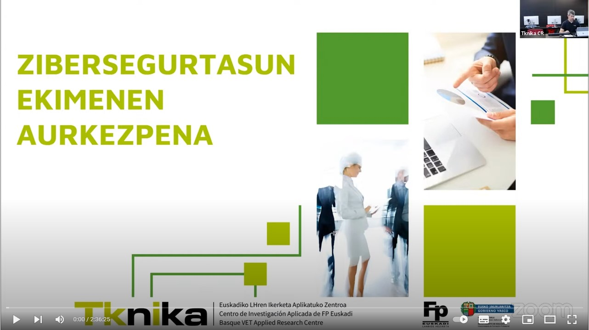 </a>
       
   - **Cybasque:** 
   
   Euskadiko zibersegurtasun-industriak ordezkatzen dituen elkartea da [Cybasque](https://www.cybasque.eus/eu_ES/home-cybasque). Enpresengadik gertu egoteko beharrari erantzuteko ezinbestekoa da horrelako elkarteetan partehartzea, eta honetan oinarrituz beraien *Talentua* lan taldeko bileretan partehartu da.
   
   **Kurtso amaieran elkartekide egiteko eskaria bideratu da.**

   
   - **TKNIKA berriak:**
     2022-23 ikasturtean [Tknika.eus](https://tknika.eus/) webgunean, Zibersegurtasun alorrean eginiko ekimenen estekak.
     - [Cyber Range: Durango Maristak](https://tknika.eus/eu/cont/cyber-range-maristak-durangoko-ikasleen-saioa/)
     - [Cyber Range: Easo-Txurdinaga-Zubiri](https://tknika.eus/eu/cont/cyber-range-easo-txurdinaga-eta-zubiri-manteo/)
     - [OT Zibersegurtasun oinarriak](https://tknika.eus/eu/cont/cursos/ot-zibersegurtasun-oinarriak/)

